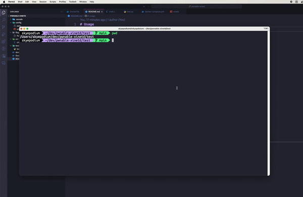

# Usage

### 1. Summary
- You just need to change the `./src/chall.c` file.

### 2. execute
- `docker-compose up -d` Run docker container after building docker image
- `docker-compose down` remove container

### 3. test
Run test.py to check shell interaction
```
python3 test.py
```

   